# ai-identicon

Generative, animated **avatars for AI agents** — a deterministic visual
identity grown from a seed string. Instead of a photoreal face (creepy) or a
cartoon mascot (cheesy), each agent gets an irregular faceted **presence**: a
"broken-whole" cluster of crystalline shards that reads as an object with
character, and can come alive — listening, thinking, speaking — without ever
pretending to be human.

Same seed → same avatar, **forever**, under a given generation version.

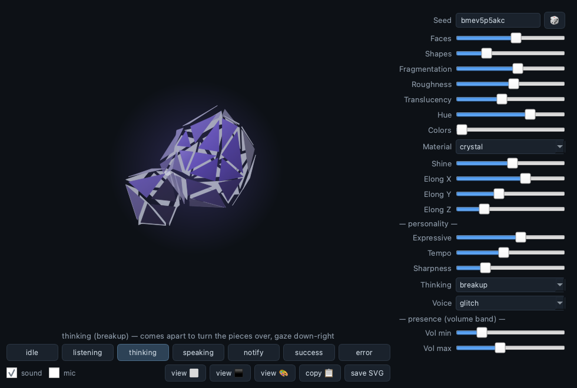

```python
from ai_identicon import Genome, color_svg, line_art_svg

g = Genome.from_seed("agent://alice")          # deterministic identity
open("alice.svg", "w").write(color_svg(g))     # a filled, shaded portrait
open("alice-line.svg", "w").write(line_art_svg(g, "white"))  # line-art, for dark UIs
```

## Why

- **Deterministic & frozen.** Every avatar is derived from `(seed, algo_version,
  brand, overrides)`. The generation algorithm is versioned and immutable:
  improving it later ships as a new `ALGO_VERSION`, so an existing agent's face
  never changes under it. A committed golden-file suite locks each version.
- **Identicon-grade distinctness.** Curated, perceptually-spaced hue buckets and
  categorical materials (the lesson from jazzicons/blockies) so two seeds are
  either clearly the same or clearly different — not a subtle blur.
- **Alive, but calm.** A headless state model (`idle / listening / thinking /
  speaking / notify / success / error`) with gaze choreography, breathing,
  blinks, and shard micro-physics. Present without being noisy; never
  interrupts.
- **Zero-dependency core.** `genome`, `geometry`, `model`, `portrait`,
  `controller` are pure Python. SVG portraits need nothing. The live animated
  widget and mic-reactive audio are an optional Qt extra.

## The states

The orb expresses what an agent is doing through motion and light — never a
face. One seed (`bmev5p5akc`), all seven states:

<table>
  <tr>
    <td align="center">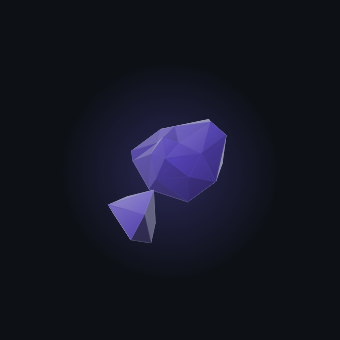<br><b>idle</b><br><sub>at rest, breathing; the odd blink</sub></td>
    <td align="center">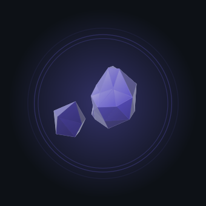<br><b>listening</b><br><sub>turns to face you; ripples drift inward</sub></td>
    <td align="center">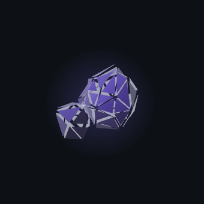<br><b>thinking</b><br><sub>comes apart to turn it over, gaze down‑right</sub></td>
    <td align="center">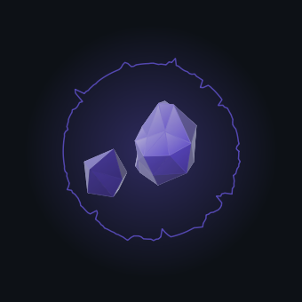<br><b>speaking</b><br><sub>voice drawn as a waveform around it</sub></td>
  </tr>
  <tr>
    <td align="center"><br><b>notify</b><br><sub>a chirp and an excited spin; self‑returns</sub></td>
    <td align="center"><br><b>success</b><br><sub>a warm pulse and spin‑up; self‑returns</sub></td>
    <td align="center">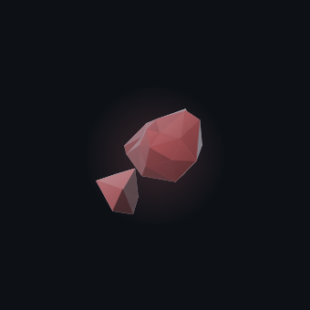<br><b>error</b><br><sub>seized: rotation frozen, amber, one flinch</sub></td>
    <td align="center"><sub>notify / success / error are transient —<br>they play out and settle back to idle.</sub></td>
  </tr>
</table>

## Install

```bash
pip install ai-identicon          # core: genomes + SVG portraits (no deps)
pip install "ai-identicon[qt]"    # + the live animated widget and audio
```

## Static portraits (pure, no Qt)

```python
from ai_identicon import Genome, color_svg, line_art_svg, export_svg

g = Genome.from_seed("EK7f...aid-prefix")
color_svg(g, px=40)               # tuned for a 40px avatar
line_art_svg(g, "black", px=40)   # dark strokes for light UIs
line_art_svg(g, "white")          # light strokes for dark UIs
export_svg(g, "out.svg", variant="color")
```

Portraits render the canonical front pose (physics-settled), size-aware: at
small sizes strokes thicken and near-coplanar interior lines fade to whispers,
so the mark still reads as a shape at 40px.

## Live widget (Qt)

```python
from ai_identicon import Genome, AvatarController
from ai_identicon.widget import PresenceWidget
from ai_identicon.audio import SoundBank

orb = PresenceWidget(Genome.from_seed("agent://alice"), sounds=SoundBank())
ctl = AvatarController(orb)       # map your assistant's lifecycle to states
ctl.thinking(); ctl.speaking(); ctl.on_audio(amplitude=level)
```

Run the interactive gallery: `python examples/gallery.py` (its **copy 📋**
button puts the avatar on the clipboard to paste into chats/notes).

## Copy to clipboard (Qt)

```python
from ai_identicon import Genome
from ai_identicon.clipboard import copy_to_clipboard   # needs a running Qt app

copy_to_clipboard(Genome.from_seed("agent://alice"))   # pasteable PNG
```

Copies a **PNG** (with the SVG attached as a bonus MIME) — PNG is the format
that pastes reliably into Obsidian, MS Teams, Signal, Discord, Slack, and
docs, and it keeps transparency so the avatar drops onto any background. The
live widget has a convenience method too: `presence_widget.copy_to_clipboard()`.

## Customization & brands

```python
from ai_identicon import Genome, Brand

# pin specific fields; everything unpinned still tracks the seed
g = Genome.from_seed("alice").with_overrides(material=1, hue=250)

# constrain a whole product's palette/materials to a brand
brand = Brand(hues=(215, 250, 285), materials=("crystal", "glass"))
g = Genome.from_seed("alice", brand=brand)

g.to_dict()   # {seed, algo_version, brand, overrides} — the portable identity
```

## Determinism contract

The **package version** (semver) and **`ALGO_VERSION`** (the avatar-generation
contract) are independent. Package releases never alter an existing seed's
avatar; only a new `ALGO_VERSION` may, and prior versions stay renderable. This
is enforced by `tests/golden_v1.json`.

## Security note

An avatar is an identity **affordance**, not a control. A determined party can
grind seeds toward a look-alike, so never let the avatar substitute for a
verifiable identifier (e.g. show the full AID/prefix where trust matters).

## Meet some of the faces

Sixteen names, sixteen seeds, sixteen agents you'd know on sight. Each one is
just `Genome.from_seed(name)` rendered as a color portrait — deterministic, so
"James" always looks like *James*, everywhere, forever. 👋

<table>
  <tr>
    <td align="center"><br><sub>James</sub></td>
    <td align="center">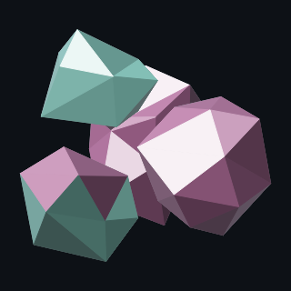<br><sub>Mary</sub></td>
    <td align="center"><br><sub>Michael</sub></td>
    <td align="center">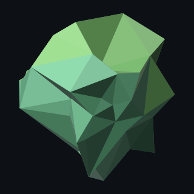<br><sub>Jennifer</sub></td>
  </tr>
  <tr>
    <td align="center">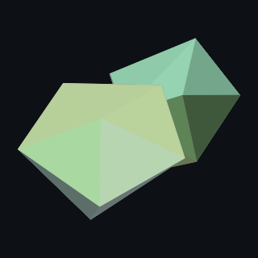<br><sub>William</sub></td>
    <td align="center">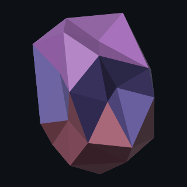<br><sub>Elizabeth</sub></td>
    <td align="center">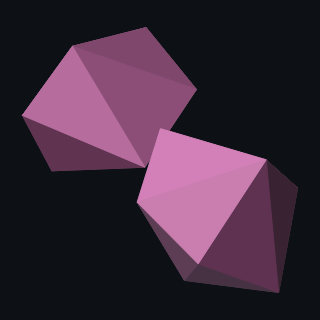<br><sub>David</sub></td>
    <td align="center">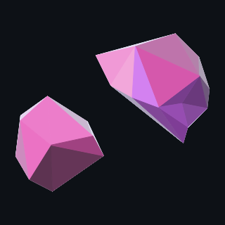<br><sub>Sarah</sub></td>
  </tr>
  <tr>
    <td align="center"><br><sub>John</sub></td>
    <td align="center">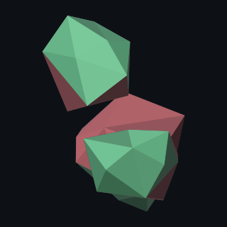<br><sub>Jessica</sub></td>
    <td align="center"><br><sub>Robert</sub></td>
    <td align="center">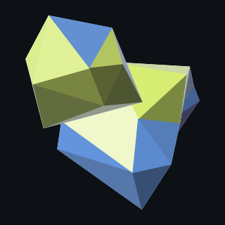<br><sub>Emily</sub></td>
  </tr>
  <tr>
    <td align="center">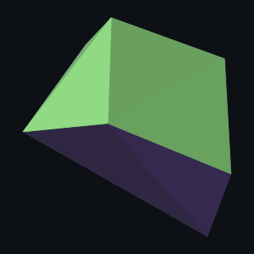<br><sub>Joseph</sub></td>
    <td align="center">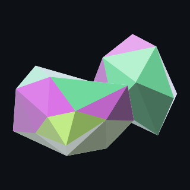<br><sub>Emma</sub></td>
    <td align="center">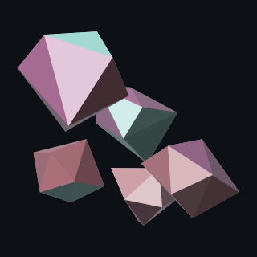<br><sub>Daniel</sub></td>
    <td align="center"><br><sub>Olivia</sub></td>
  </tr>
</table>

## License

MIT.
